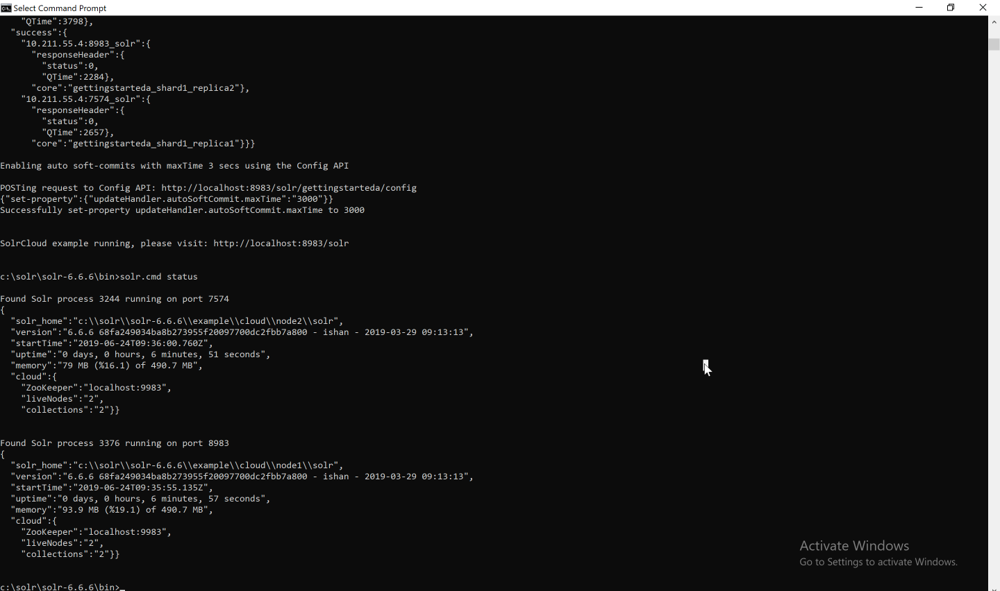

# Exercise 02 - Runnig basic commands

1. Start Solr with a custom port:

```bash
bin\solr.cmd start -p 8984
```

Based on your operating system, you have to use bin/solr or bin\solr.cmd.

2. Stop Solr:

```bash
bin\solr.cmd stop -all
```

TIPS:

* -all parameter stops all Solr instances
* -p to stop a specific port

3. Start Solr in cloud mode. Do the following steps:

Run command:

```bash
bin\solr.cmd -e cloud
```

```text
This interactive session will help you launch a SolrCloud cluster on your local workstation.
To begin, how many Solr nodes would you like to run in your local cluster? (specify 1-4 nodes) [2]:
```

Write: `2`

```text
Ok, let's start up 2 Solr nodes for your example SolrCloud cluster.
Please enter the port for node1 [8983]:
```

Write: `8983`

```text
Please enter the port for node2 [7574]:
```

Write: `7574`

```text
Now let's create a new collection for indexing documents in your 2-node cluster.
Please provide a name for your new collection: [gettingstarted]
```
Write: `gettingstarted`

```text
How many shards would you like to split gettingstarted into? [2]
```

Write: `2`

```text
How many replicas per shard would you like to create? [2]
```

Write: `2`

```text
Please choose a configuration for the gettingstarteda collection, available options are:
basic_configs, data_driven_schema_configs, or sample_techproducts_configs [data_driven_schema_configs]
```

Write `data_driven_schema_configs`

Open http://localhost:8983/solr/#/~cloud

5. Check out the number of Solr instances:

```bash
bin\solr.cmd status
```

You should be able to see the following:


6. Create a new core:

```bash
bin\solr.cmd create -c core-test
```

7. Delete a core (collection) via web browser:  

```text
http://localhost:8983/solr/admin/collections?action=DELETE&name=core-test
```

8. Add a document in collection:

```bash
cd C:\solr\solr-6.6.6\example\exampledocs\

java -Dauto -Dc=gettingstarted -jar post.jar solr-word.pdf
```
Open in web brouser:
http://localhost:8983/solr/gettingstarted/select?indent=on&q=*solr*&wt=json 

 
Should get a response like this: 

```JSON
{
  "responseHeader":{
    "zkConnected":true,
    "status":0,
    "QTime":42,
    "params":{
      "q":"*solr*",
      "indent":"on",
      "wt":"json"}},
  "response":{"numFound":1,"start":0,"maxScore":1.0,"docs":[
      {
        "id":"C:\\solr\\solr-6.6.6\\example\\exampledocs\\solr-word.pdf",
        "date":["2008-11-13T13:35:51Z"],
        "pdf_docinfo_custom_aapl_keywords":["solr, word, pdf"],
        "pdf_pdfversion":[1.3],
        "pdf_docinfo_title":["solr-word"],
        "xmp_creatortool":["Microsoft Word"],
        "stream_content_type":["application/pdf"],
        "access_permission_can_print_degraded":[true],
        "subject":["solr word"],
        "dc_format":["application/pdf; version=1.3"],
        "pdf_docinfo_creator_tool":["Microsoft Word"],
        "access_permission_fill_in_form":[true],
        "pdf_encrypted":[false],
        "dc_title":["solr-word"],
        "modified":["2008-11-13T13:35:51Z"],
        "cp_subject":["solr word"],
        "pdf_docinfo_subject":["solr word"],
        "pdf_docinfo_creator":["Grant Ingersoll"],
        "meta_author":["Grant Ingersoll"],
        "meta_creation_date":["2008-11-13T13:35:51Z"],
        "created":["Thu Nov 13 13:35:51 UTC 2008"],
        "access_permission_extract_for_accessibility":[true],
        "creation_date":["2008-11-13T13:35:51Z"],
        "resourcename":["C:\\solr\\solr-6.6.6\\example\\exampledocs\\solr-word.pdf"],
        "author":["Grant Ingersoll"],
        "producer":["Mac OS X 10.5.5 Quartz PDFContext"],
        "pdf_docinfo_producer":["Mac OS X 10.5.5 Quartz PDFContext"],
        "keywords":["solr, word, pdf"],
        "access_permission_modify_annotations":[true],
        "aapl_keywords":["solr, word, pdf"],
        "dc_creator":["Grant Ingersoll"],
        "dcterms_created":["2008-11-13T13:35:51Z"],
        "last_modified":["2008-11-13T13:35:51Z"],
        "dcterms_modified":["2008-11-13T13:35:51Z"],
        "title":["solr-word"],
        "last_save_date":["2008-11-13T13:35:51Z"],
        "pdf_docinfo_keywords":["solr, word, pdf"],
        "pdf_docinfo_modified":["2008-11-13T13:35:51Z"],
        "meta_save_date":["2008-11-13T13:35:51Z"],
        "content_type":["application/pdf"],
        "stream_size":[21052],
        "x_parsed_by":["org.apache.tika.parser.DefaultParser",
          "org.apache.tika.parser.pdf.PDFParser"],
        "creator":["Grant Ingersoll"],
        "dc_subject":["solr, word, pdf"],
        "access_permission_assemble_document":[true],
        "xmptpg_npages":[1],
        "access_permission_extract_content":[true],
        "access_permission_can_print":[true],
        "meta_keyword":["solr, word, pdf"],
        "access_permission_can_modify":[true],
        "pdf_docinfo_created":["2008-11-13T13:35:51Z"],
        "_version_":1637216577462992896}]
  }}
  ```