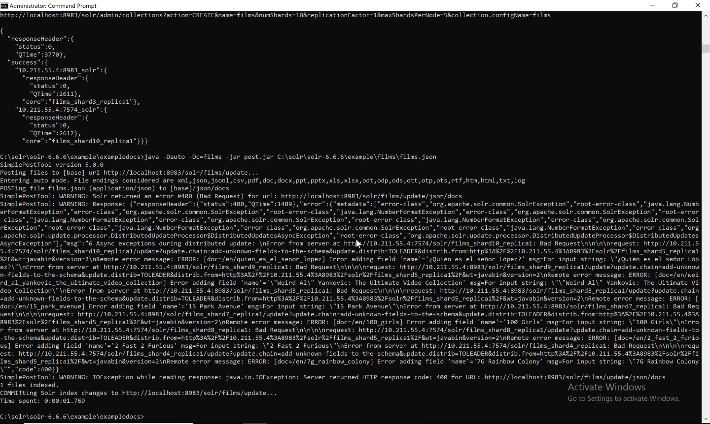

# Exercise 03 - Loading sample data

We will use the same $solr_home/example/films for our queries.

1. Open the terminal and create a collection films with 10 shards:

```bash
bin\solr create -c films -shards 10
```

2. Import films.json fila via post.jar

```bash
cd C:\solr\solr-6.6.6\example\exampledocs\

java -Dauto -Dc=films -jar post.jar C:\solr\solr-6.6.6\example\films\films.json
```

Warning: It throws an error, as follows:



3. Delete films collection via web browser:  

```text
http://localhost:8983/solr/admin/collections?action=DELETE&name=films
```

4. Open the terminal and create a collection films with 10 shards:

```bash
bin\solr create -c films -shards 10 -n shemaless
```

5. Do the following POST request through Postman application or Curl

```HTTP
POST /solr/films/schema HTTP/1.1
Host: localhost:8983
Content-Type: application/json

{
    "replace-field": {
        "name": "name",
        "type": "text_general",
        "multiValued": false,
        "stored": true
    }
}
```


```curl
curl -X POST \
  http://localhost:8983/solr/films/schema \
  -H 'Accept: */*' \
  -H 'Content-Type: application/json' \
  -d '{
    "replace-field": {
        "name": "name",
        "type": "text_general",
        "multiValued": false,
        "stored": true
    }
}'
```
Note: It tells to Solr to expect a field's name as a text rather than letting it auto-guess as Float

6. Import films.json fila via post.jar

```bash
cd C:\solr\solr-6.6.6\example\exampledocs\

java -Dauto -Dc=films -jar post.jar C:\solr\solr-6.6.6\example\films\films.json
```

7. Open in web brouser:
http://localhost:8983/solr/films/select?indent=on&q=*:*&rows=1000&wt=json

8. Import films.csv fila via post.jar

```bash
cd C:\solr\solr-6.6.6\example\exampledocs\

java -Dtype=text/csv -Dc=films -jar post.jar C:\solr\solr-6.6.6\example\films\*.csv
```