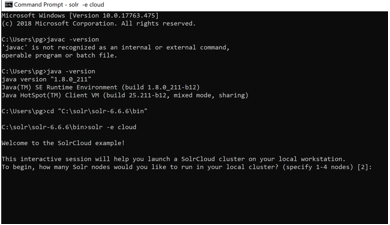

# Exercise 01

Apache Solr requires the following prerequisites:

• Java 8 (mandatory). Require JRE version 1.8 or higher for Solr to run.

1. Open Command Prompt, type the following command, and check your Java version: ```$ java -version ```
It should show the following output:


If your output is something different, it means Java is not properly installed and it needs to be installed properly.
Also, the `PATH` variable should point to JRE 1.8. You can [download Java](http://www.oracle.com/technetwork/java/javase/downloads/index.html)  if needed.

2. Download Apache Solr

    Important: Apache Solr can also run as a standalone unit and is operating system independent. It would be the same across the operating systems; the difference would be in the way we reach there. 

    2.1. To install Solr, follow along steps:
    * Go to [Apache Solr 6.X](https://archive.apache.org/dist/lucene/solr/6.6.6/). 
    * Click on `DOWNLOAD`. Download the solr-6.6.6.zip file and extract it to a location of your choice.

    The extracted location should be something like this, with the folder structure as follows: 

3. Navigate to the `bin` folder. The folder contains the Solr startup script.

4. Open the terminal and hit the following command:
solr -e cloud

Will open up an interactive prompt screen, as shown in the following screenshot:


5. Do the follow steps:

```
To begin, how many Solr nodes would you like to run in your local cluster? (specify 1-4 nodes) [2]:
```
Write: `2`

```
Ok, let's start up 2 Solr nodes for your example SolrCloud cluster.
Please enter the port for node1 [8983]:
```

Write: `8983`

```
Please enter the port for node2 [7574]:
```
Write: `7574`

```
Now let's create a new collection for indexing documents in your 2-node cluster.
Please provide a name for your new collection: [gettingstarted]
```
Write: `gettingstarted`

```
How many shards would you like to split gettingstarted into? [2]
```
Write: `2`

```
How many replicas per shard would you like to create? [2]
```
Write: `2`

```
Please choose a configuration for the gettingstarted collection, available options are:
basic_configs, data_driven_schema_configs, or sample_techproducts_configs [data_driven_schema_configs]
```
Write: `data_driven_schema_configs`

If everything goes well, you should see the following screen:


6.	Navigate  to http://localhost:8983/solr/#/  or http://localhost:7574/solr/#/ 

    You should be able to see the following admin interface: 
    