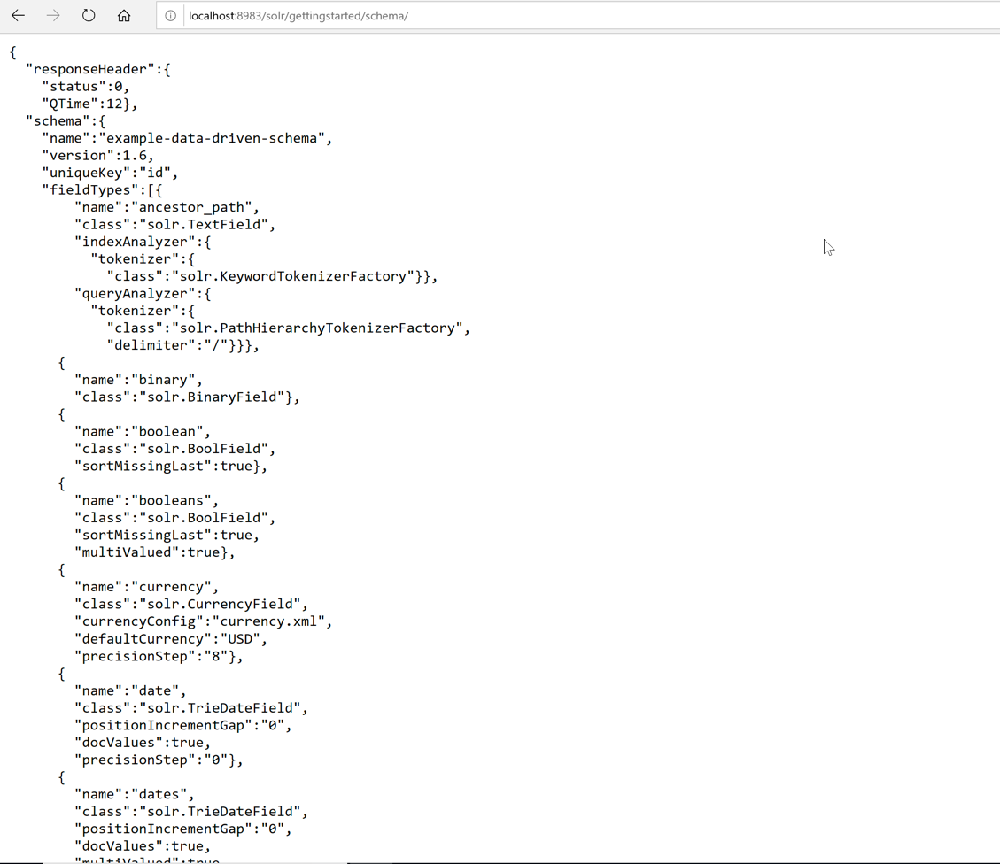

# Exercise 01 - Schema API operations

Assuming that we are using the gettingstarted collection, the base address of API will be http://localhost:8983/solr/gettingstarted

1. To see the schema, enter the `/schema` endpoint:

```
http://localhost:8983/solr/gettingstarted/schema/
```

This will retrieve the entire schema information:


2. Add a song-name field name whose type is text_general to the gettingstarted schema.

```bash
curl -X POST \
  http://localhost:8983/solr/gettingstarted/schema \
  -H 'Content-Type: application/json' \
  -d '{
    "add-field": {
        "name": "song-name",
        "type": "text_general",
        "stored": true
    }
}'
```

3. Replace the definition of song with string

```bash
curl -X POST \
  http://localhost:8983/solr/gettingstarted/schema \
  -H 'Content-Type: application/json' \
  -d '{
  "replace-field": {
    "name": "song-name",
    "type": "string",
    "stored": false
  }
}'
```

4. Delete the song-name field:

```bash
curl -X POST \
  http://localhost:8983/solr/gettingstarted/schema \
  -H 'Content-Type: application/json' \
  -d '{
  "delete-field": {
    "name": "song-name"
  }
}'
```

5. Add, delete, and replace dynamic field rules:

Need to use the following endpoints:

* add-dynamic-field
* delete-dynamic-field
* replace-dynamic-field

6. Add a new field type for song description, which is of TextField type and uses WhitespaceTokenizerFactory as a tokenizer using a filter WordDelimiterFilterFactory:

```bash
curl -X POST \
  http://localhost:8983/solr/gettingstarted/schema \
  -H 'Content-Type: application/json' \
  -d '{
  "add-field-type": {
    "name": "song-description-field",
    "class": "solr.TextField",
    "positionIncrementGap": "100",
    "analyzer": {
      "charFilters": [
        {
          "class": "solr.PatternReplaceCharFilterFactory",
          "replacement": "$1$1",
          "pattern": "([a-zA-Z])\\\\1+"
        }
      ],
      "tokenizer": {
        "class": "solr.WhitespaceTokenizerFactory"
      },
      "filters": [
        {
          "class": "solr.WordDelimiterFilterFactory",
          "preserveOriginal": "0"
        }
      ]
    }
  }
}'
```

6. Add or delete a copy field rule, use the following:  

* add-copy-field
* delete-copy-field
