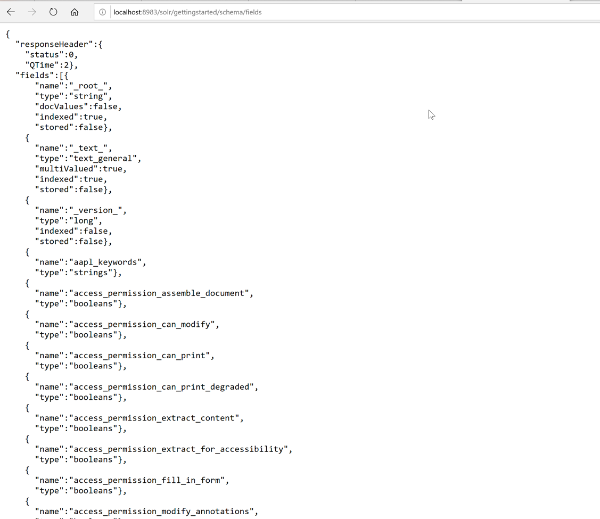
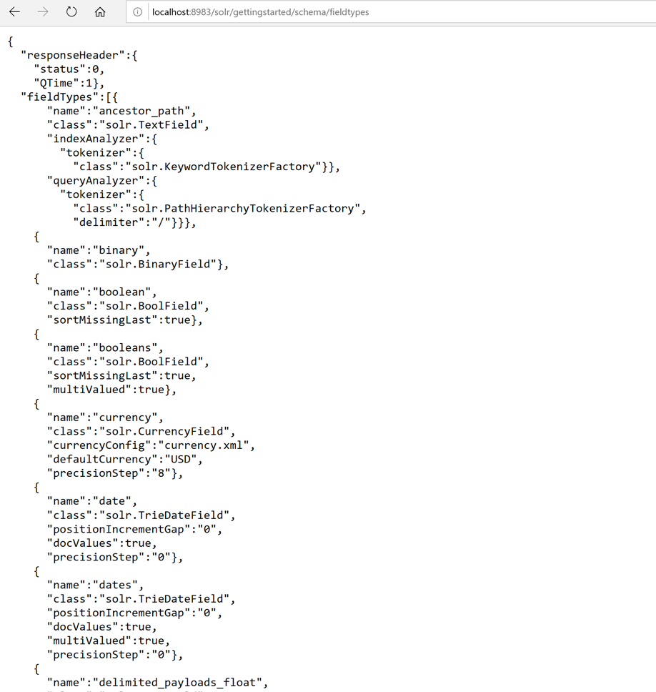
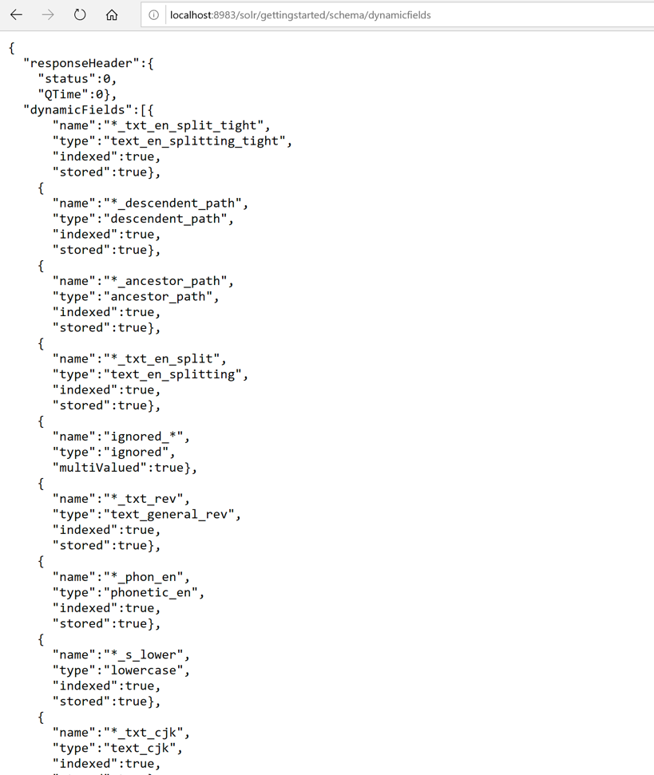

# Exercise 02 - Listing fields, field types, DynamicFields, and CopyField rules 

  
1. List of all the defined fields

Type the following URL in the browser: 
```http://localhost:8983/solr/gettingstarted/schema/fields```

Response:
 

2. List of the field types

Enter this `http://localhost:8983/solr/gettingstarted/schema/fieldtypes`

Response:



3. Get an individual field type by passing the field type name

4. Display dynamic fields and copy field rules

Use endpoint: `http://localhost:8983/solr/gettingstarted/schema/dynamicfields`

Response
 
 
5. List of all copy fields
 
URL: `http://localhost:8983/solr/gettingstarted/schema/copyfields`

6. Get Schema name's details, use this URL: `http://localhost:8983/solr/gettingstarted/schema/name` 

7. Get the schema version, use this URL: `http://localhost:8983/solr/gettingstarted/schema/version`