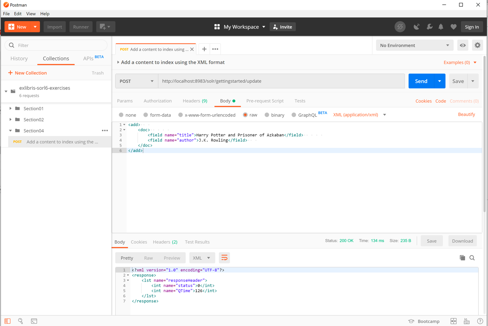
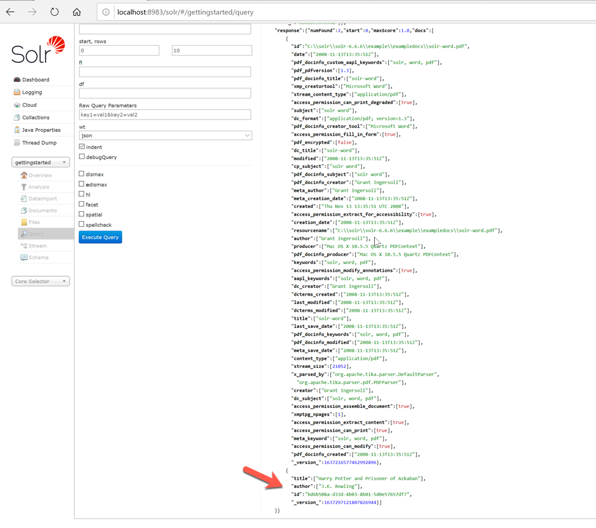
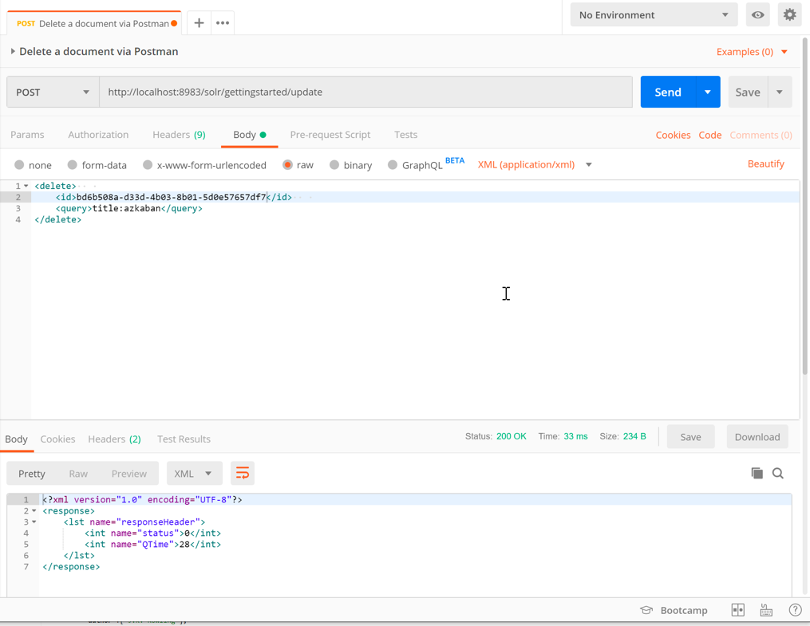

# Exercise 01 - Index handler with the XML format
 
1. Add a content to index using the XML format.
Open the Postman tool and add the URL `http://localhost:8983/solr/gettingstarted/update`

Note: You need to add a request header, Content-Type, to text/xml.

Add the  content:

```XML
<add>
    <doc>
        <field name="title">Harry Potter and Prisoner of Azkaban</field>
        <field name="author">J.K. Rowling</field>
    </doc>
</add>
```

Click on the Send button in Postman.

Should see the following response:

This indicates that the document has been successfully

2. Query via Solr admin console.
Go to the Solr admin console in the browser, select gettingstarted, and then navigate to the Query section, as follows:


3. Delete a document via Postman.
Open Postman and just replace the content with the following:

```XML
<delete>
    <id>bd6b508a-d33d-4b03-8b01-5d0e57657df7</id>
</delete>
```

In Postman, it will look  like this once executed:

