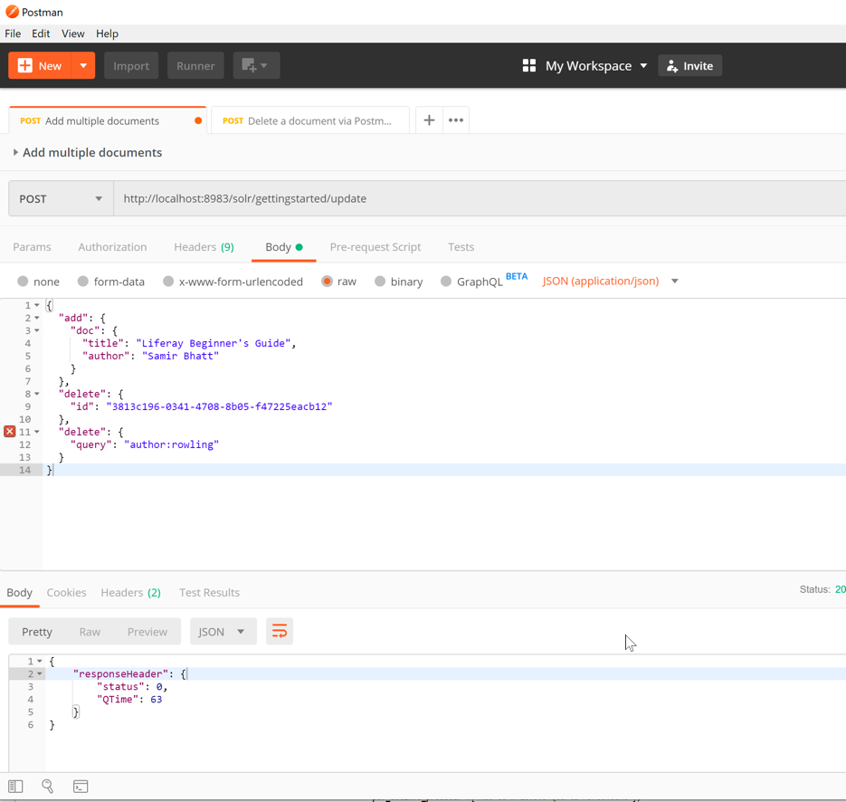

# Exercise 02 - Index handler with the JSON format

1. Add a content to index using the JSON format.
Open the Postman tool and add the URL `http://localhost:8983/solr/gettingstarted/update/json/docs`

Note: You need to add a request header, `Content-Type`, to `application/json`.

Add the  content:

```JSON
{
    "title": "Jonathan Livingston Seagull",
    "author": "Rechard Bach"
}
```

Click on the `Send` button in Postman.

Should see the following response:

This indicates that the document has been successfully

2. Query via Solr admin console.
Go to the Solr admin console in the browser, select gettingstarted, and then navigate to the Query section, as follows:


3. Add multiple documents via Postman

Add the content:

```JSON
[
  {
    "title": "Red sails to Capri",
    "author": "Ann Weil"
  },
  {
    "title": "Five Point Someone",
    "author": "Chetan Bhagat"
  }
]
```

4. Add, update, or delete documents in a single operation

Delete some documents and add a new document:

```bash
{
  "add": {
    "doc": {
      "title": "Liferay Beginner's Guide",
      "author": "Samir Bhatt"
    }
  },
  "delete": {
    "id": "3813c196-0341-4708-8b05-f47225eacb12"
  },
  "delete": {
    "query": "author:rowling"
  }
}
```

In Postman, it will look  like this once executed:

