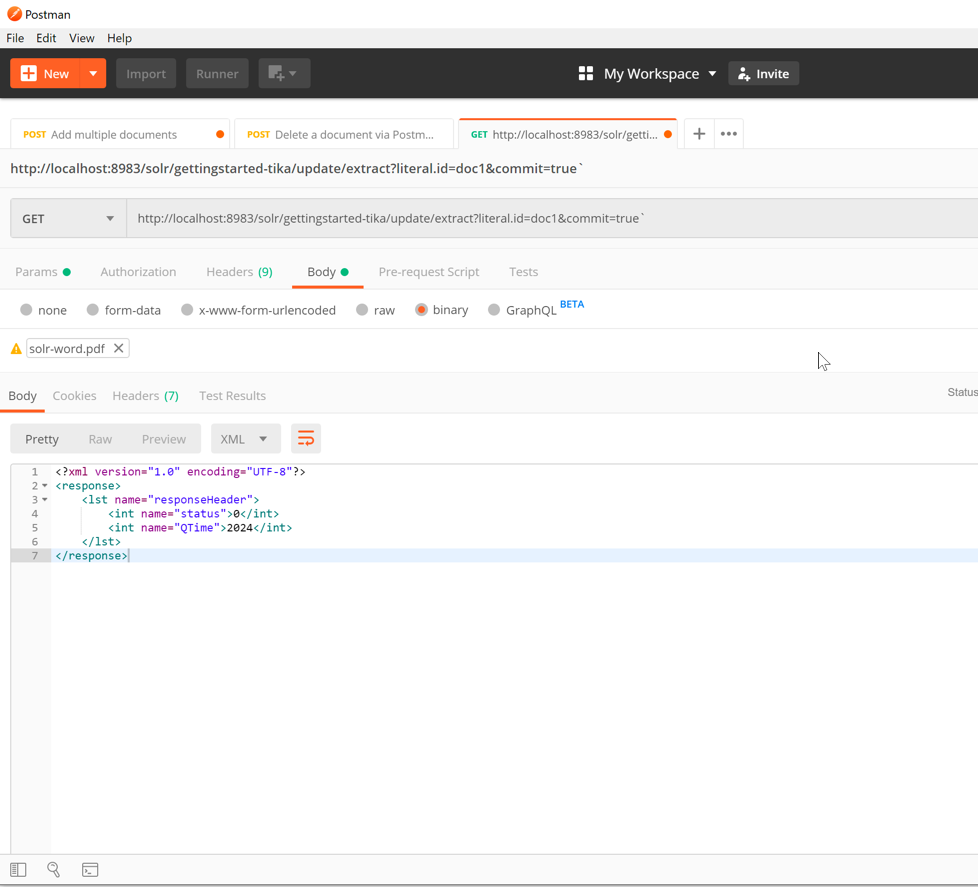
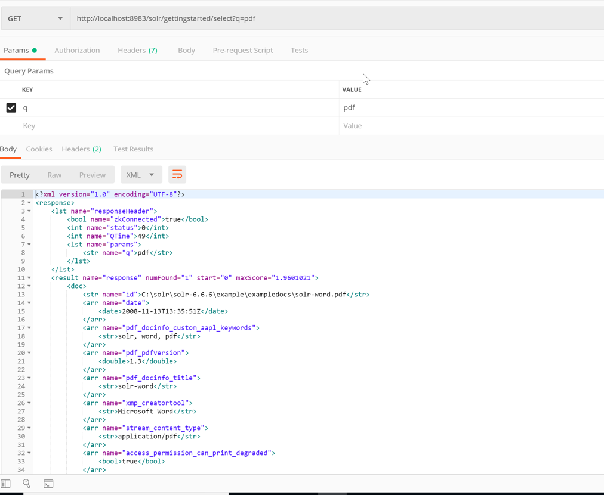

# Exercise 03 - Indexing a binary using Tika

1. To start a new one node, a command as follows. follows.

```bash
solr create_collection -c gettingstarted-tika
```

2. Open Postman and create a new POST request with the URL

`http://localhost:8983/solr/gettingstarted-tika/update/extract?literal.id=doc1&commit=true`

3. Upload the 'solr-word.pdf' file in the binary section.

4. Finally submit the request as follows. You will see that the request is successful, with status code 0.



5. Use Postman to query for PDF documents URL: `http://localhost:8983/solr/gettingstarted/select?q=pdf`


Note: While making the request, we specified literal.id=doc1, which tells Solr to use doc1 as the unique ID for this particular document.
