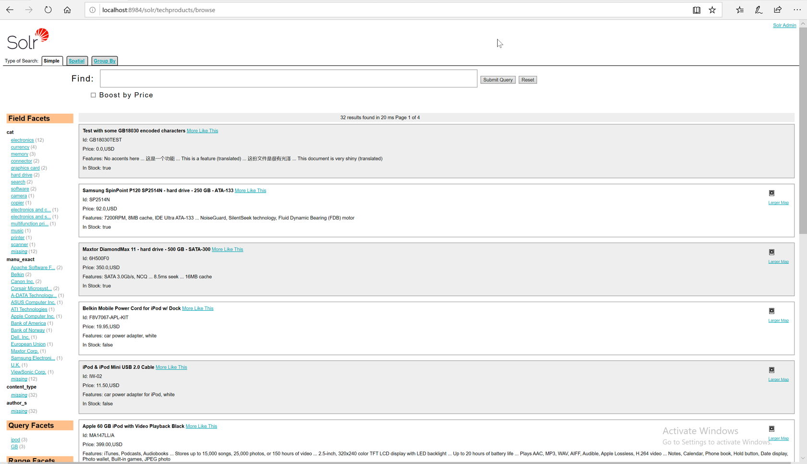

# Exercise 01 - Velocity search UI
 
1. Add new `techproducts` collection

Open up the terminal and hit:

```bash
solr.cmd -e techproducts -p 8984
```

Should see the following response:

```text
Solr techproducts example launched successfully. 
Direct your Web browser to http://localhost:8984/solr to visit the Solr Admin UI
```

Note: As we have loaded a sample techproducts config set, it will import a bunch of files into the collection while starting up the server. 

2. Check out the browse interface provided by Solr: hit `http://localhost:8984/solr/techproducts/browse` 

Should be following screenshot:
