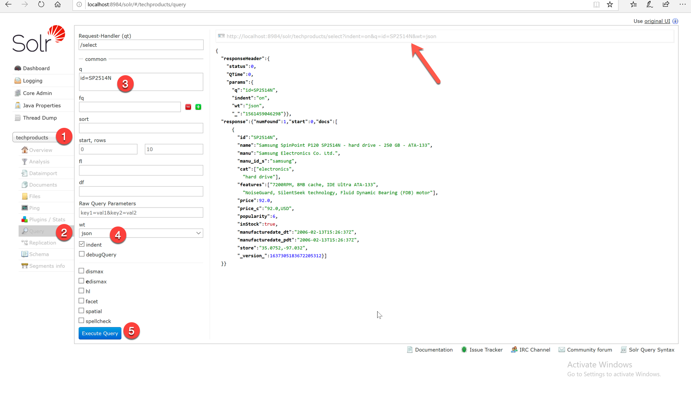

# Exercise 02 - Standard query parser response
 


1. Search for field id=SP2514N via Solr admin console.
URL: `http://localhost:8984/solr/techproducts/select?indent=on&q=id=SP2514N&wt=json` 

In Solr admin console, while running a query to search a product with id=SP2514N displays the response as follows:


2. Use two fields, `id` and `name` the query `id=SP2514N` in response. 
URL: `http://localhost:8984/solr/techproducts/select?indent=on&q=id,name=SP2514N&wt=json`

Response:
```JSON
{
  "responseHeader":{
    "status":0,
    "QTime":0,
    "params":{
      "q":"id,name=SP2514N",
      "indent":"on",
      "wt":"json"}},
  "response":{"numFound":1,"start":0,"docs":[
      {
        "id":"SP2514N",
        "name":"Samsung SpinPoint P120 SP2514N - hard drive - 250 GB - ATA-133",
        "manu":"Samsung Electronics Co. Ltd.",
        "manu_id_s":"samsung",
        "cat":["electronics",
          "hard drive"],
        "features":["7200RPM, 8MB cache, IDE Ultra ATA-133",
          "NoiseGuard, SilentSeek technology, Fluid Dynamic Bearing (FDB) motor"],
        "price":92.0,
        "price_c":"92.0,USD",
        "popularity":6,
        "inStock":true,
        "manufacturedate_dt":"2006-02-13T15:26:37Z",
        "manufacturedate_pdt":"2006-02-13T15:26:37Z",
        "store":"35.0752,-97.032",
        "_version_":1637305183672205312}]
  }}
```

3. Change format the response by setting the wt parameter as json, xml, xslt, javabin, geojson, python, php, phps, ruby, csv..